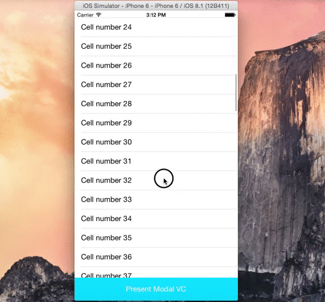

# ModalInWindow

Supports different orientations for presenting and presented viewControllers. Fix the issue in iOS8 which you cannot force the presenting viewController to stay portrait while the presentd viewcontrolelr is in landscape. 

